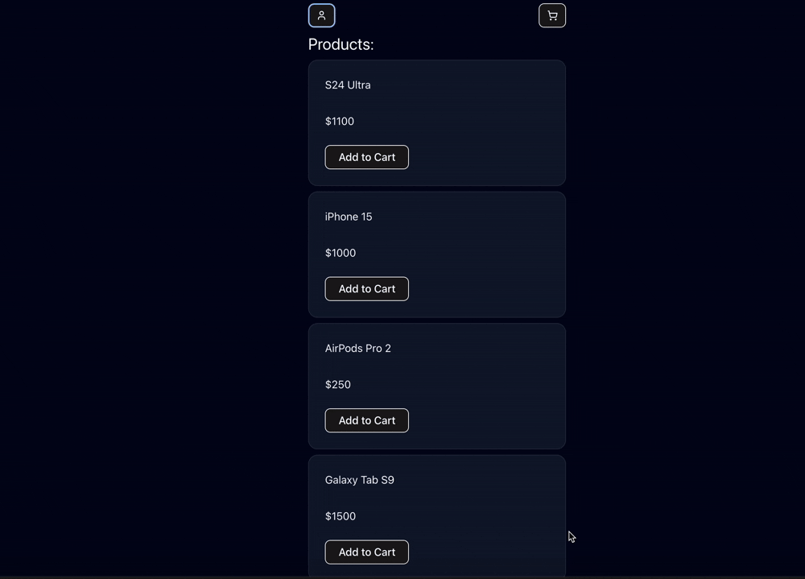

<div align="center">
  
  
  
  
  
</div>

# Zustand Shop

Clean and concise front-end only functional shopping store with product and cart manipulation.

[Checkout the demo](https://vinodg006.github.io/zustand_shop/)



## Tech Stack

**Library:** React (Typescript)

**State Management:** Zustand

**Styling:** TailwindCSS, Shadcn UI

**Bundler:** Vite

## Usage

**Installation**

Install the project dependencies using npm:

```bash
npm install
```

**Running the Project**

```bash
npm run dev
```
